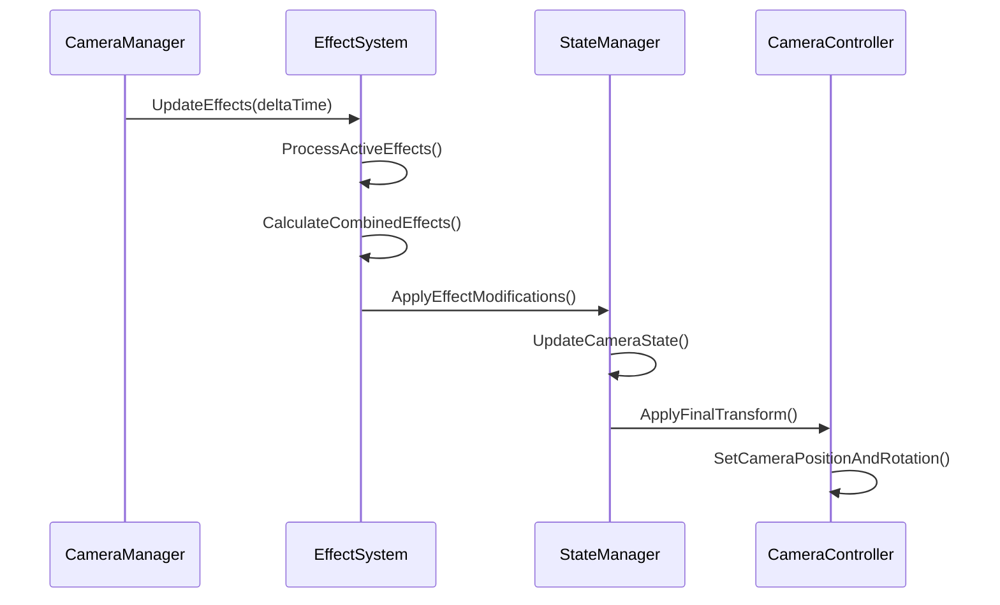

# RPG游戏摄像机控制系统设计

## 概述

本文档总结了RPG游戏中常见的摄像机控制效果，分析了现有的摄像机系统实现，并提出了一个模块化、可扩展的摄像机系统架构设计。

## 1. 常见的RPG摄像机控制效果

### 1.1 基础跟随效果

#### 平滑跟随 (Smooth Follow)
- **描述**: 摄像机以平滑插值的方式跟随目标角色移动
- **参数**: 跟随速度、跟随距离、跟随高度
- **应用场景**: 角色移动、场景漫游
- **实现要点**: 使用Lerp或SmoothDamp进行位置插值

#### 智能跟随 (Smart Follow)
- **描述**: 根据地形和环境智能调整摄像机位置
- **参数**: 地形检测半径、避障距离
- **应用场景**: 复杂地形环境
- **实现要点**: 射线检测、碰撞避免算法

### 1.2 屏幕震动效果

#### 冲击震动 (Impact Shake)
- **描述**: 受到攻击或释放技能时产生短暂震动
- **参数**: 震动幅度、震动频率、持续时间
- **应用场景**: 战斗系统、技能释放
- **实现要点**: 随机偏移、衰减算法

#### 环境震动 (Environmental Shake)
- **描述**: 环境事件引起的持续震动
- **参数**: 震动强度、震动模式、触发条件
- **应用场景**: 地震、爆炸等环境效果
- **实现要点**: 基于事件的触发机制

#### 自定义震动模式
- **描述**: 支持多种预设的震动模式
- **参数**: 震动曲线、衰减函数
- **应用场景**: 不同的技能和环境效果
- **实现要点**: 曲线编辑器、模式配置系统

### 1.3 锁定系统

#### 自动锁定 (Auto Lock-On)
- **描述**: 自动选择最近或最合适的敌人进行锁定
- **参数**: 锁定距离、锁定角度、优先级权重
- **应用场景**: 战斗系统
- **实现要点**: 球形检测、角度计算、优先级排序

#### 手动锁定 (Manual Lock-On)
- **描述**: 玩家手动选择锁定目标
- **参数**: 锁定切换速度、目标指示器
- **应用场景**: Boss战、多目标战斗
- **实现要点**: 输入检测、UI指示器

### 1.4 视角切换效果

#### 第一/第三人称切换
- **描述**: 在第一人称和第三人称视角间切换
- **参数**: 切换动画时间、视角参数
- **应用场景**: 不同游戏模式
- **实现要点**: 相机参数切换、动画过渡

#### 过肩视角 (Over-the-Shoulder)
- **描述**: 经典的第三人称射击游戏视角
- **参数**: 肩部偏移、视角角度、距离
- **应用场景**: 动作RPG战斗
- **实现要点**: 骨骼绑定、动态调整

#### 俯视视角 (Top-Down)
- **描述**: 俯视视角，适合策略类游戏
- **参数**: 俯视角度、缩放范围
- **应用场景**: 回合制RPG、策略游戏
- **实现要点**: 正交投影、缩放控制

### 1.5 战斗特殊效果

#### 镜头拉近 (Zoom In)
- **描述**: 战斗开始或重要时刻拉近镜头
- **参数**: 拉近速度、目标距离、持续时间
- **应用场景**: 技能释放、剧情高潮
- **实现要点**: 缓动函数、事件触发

#### 镜头拉远 (Zoom Out)
- **描述**: 展示更大范围场景或逃脱镜头
- **参数**: 拉远速度、最大距离、恢复时间
- **应用场景**: 范围技能、场景展示
- **实现要点**: 距离插值、自动恢复

#### 慢镜头效果 (Slow Motion)
- **描述**: 时间减缓配合镜头特写
- **参数**: 时间缩放比例、持续时间
- **应用场景**: 重要战斗、技能释放
- **实现要点**: Time.timeScale控制

### 1.6 场景过渡效果

#### 场景切换 (Scene Transition)
- **描述**: 在不同场景间平滑过渡
- **参数**: 过渡时间、过渡曲线
- **应用场景**: 区域切换、室内外转换
- **实现要点**: 路径规划、平滑插值

#### 固定点位 (Fixed Positions)
- **描述**: 预设的固定摄像机位置
- **参数**: 位置列表、切换条件
- **应用场景**: 剧情场景、重要地点
- **实现要点**: 位置管理、条件判断

### 1.7 高级效果

#### 路径跟随 (Path Following)
- **描述**: 摄像机沿预设路径移动
- **参数**: 路径点、移动速度、插值方式
- **应用场景**: 过场动画、轨道镜头
- **实现要点**: 贝塞尔曲线、路径编辑器

#### 动态构图 (Dynamic Composition)
- **描述**: 根据场景元素动态调整构图
- **参数**: 构图规则、权重计算
- **应用场景**: 剧情表现、环境叙事
- **实现要点**: 视觉权重计算、构图算法

## 2. 系统架构设计

### 2.1 整体架构

```mermaid
graph TB
    CameraManager[摄像机管理器]
    CameraController[摄像机控制器]
    CameraEffects[效果系统]
    CameraConfig[配置系统]
    CameraState[状态管理]
    InputHandler[输入处理]
    EventSystem[事件系统]

    CameraManager --> CameraController
    CameraManager --> CameraEffects
    CameraManager --> CameraConfig
    CameraManager --> CameraState
    CameraManager --> InputHandler
    CameraManager --> EventSystem

    CameraEffects --> ShakeEffect[震动效果]
    CameraEffects --> LockEffect[锁定效果]
    CameraEffects --> ZoomEffect[缩放效果]
    CameraEffects --> TransitionEffect[过渡效果]
    CameraEffects --> FollowEffect[跟随效果]
    CameraEffects --> RotationEffect[旋转效果]

    CameraConfig --> EffectConfigs[效果配置]
    CameraConfig --> CameraProfiles[摄像机配置]
    CameraConfig --> ProfileManager[配置管理器]

    CameraState --> CurrentState[当前状态]
    CameraState --> StateHistory[状态历史]
    CameraState --> StateTransitions[状态过渡]

    InputHandler --> CameraInput[摄像机输入]
    InputHandler --> EffectTriggers[效果触发器]

    EventSystem --> CameraEvents[摄像机事件]
    EventSystem --> EffectEvents[效果事件]
```



### 2.2 核心组件设计

#### 摄像机管理器 (CameraManager)
```csharp
public class CameraManager : Singleton<CameraManager>
{
    private CameraController mainCamera;
    private CameraEffectSystem effectSystem;
    private CameraConfigManager configManager;
    private CameraStateManager stateManager;

    public void Initialize(Camera mainCamera, Transform target);
    public void UpdateCamera(float deltaTime);
    public void ApplyEffect(string effectName, EffectParams parameters);
    public void SwitchProfile(string profileName);
}
```

#### 效果系统 (CameraEffectSystem)
```csharp
public abstract class CameraEffect
{
    public string EffectName { get; protected set; }
    public bool IsActive { get; protected set; }
    public float Priority { get; set; }

    public abstract void Activate(EffectParams parameters);
    public abstract void Deactivate();
    public abstract void Update(float deltaTime);
    public abstract Vector3 ModifyPosition(Vector3 basePosition);
    public abstract Quaternion ModifyRotation(Quaternion baseRotation);
}
```

#### 配置系统 (CameraConfigManager)
```csharp
[Serializable]
public class CameraProfile
{
    public string profileName;
    public Vector3 defaultOffset;
    public float defaultDistance;
    public float minDistance;
    public float maxDistance;
    public float rotationSpeed;
    public float zoomSpeed;
    public List<EffectConfig> effectConfigs;
}

[Serializable]
public class EffectConfig
{
    public string effectType;
    public Dictionary<string, float> parameters;
    public AnimationCurve intensityCurve;
}
```

#### 状态管理 (CameraStateManager)
```csharp
public class CameraState
{
    public Vector3 position;
    public Quaternion rotation;
    public float distance;
    public float fieldOfView;
    public List<ActiveEffect> activeEffects;
    public Dictionary<string, object> customData;
}

public class CameraStateManager
{
    private Stack<CameraState> stateHistory;
    private CameraState currentState;

    public void SaveCurrentState();
    public void RestorePreviousState();
    public void ApplyStateTransition(CameraState targetState, float duration);
}
```

### 2.3 效果组合策略

#### 优先级系统
- 每个效果都有优先级数值
- 高优先级效果可以覆盖低优先级效果
- 相同优先级按激活顺序处理

#### 效果栈 (Effect Stack)
- 效果按优先级排序
- 每个效果独立修改相机参数
- 支持效果的动态添加和移除

#### 参数融合 (Parameter Blending)
- 多个效果可能影响同一参数
- 使用加权平均或最大值策略
- 支持自定义融合函数

### 2.5 效果交互流程



### 2.6 详细接口设计

#### 核心接口
```csharp
public interface ICameraEffect
{
    string EffectName { get; }
    float Priority { get; set; }
    bool IsActive { get; }

    void Activate(CameraEffectContext context);
    void Deactivate();
    void Update(float deltaTime);
    CameraEffectResult ModifyCamera(CameraEffectInput input);
}

public struct CameraEffectContext
{
    public Camera targetCamera;
    public Transform targetTransform;
    public Vector3 basePosition;
    public Quaternion baseRotation;
    public float deltaTime;
    public Dictionary<string, object> parameters;
}

public struct CameraEffectResult
{
    public Vector3 modifiedPosition;
    public Quaternion modifiedRotation;
    public float modifiedFieldOfView;
    public bool overridePosition;
    public bool overrideRotation;
    public bool overrideFOV;
}
```

### 2.4 性能优化策略

#### 对象池化 (Object Pooling)
- 频繁创建销毁的对象使用对象池
- 减少GC压力，提高性能

#### 视锥剔除 (Frustum Culling)
- 只更新在视野内的对象
- 减少计算量

#### LOD系统 (Level of Detail)
- 根据距离调整效果复杂度
- 远距离使用简化版本

## 3. 现有代码分析

### 3.1 当前实现特点

现有Camera3D.cs实现具有以下特点：

#### 优点
- 包含基础的跟随、旋转、缩放功能
- 实现了敌人锁定系统
- 有碰撞检测机制
- 提供了丰富的配置参数

#### 缺点
- 单体架构，功能耦合度高
- 屏幕震动功能不完整
- 缺乏模块化设计
- 状态管理不够清晰
- 扩展性有限

### 3.2 重构建议

#### 功能拆分
```csharp
// 建议拆分为多个组件
public class CameraFollower : MonoBehaviour // 基础跟随
public class CameraRotator : MonoBehaviour  // 旋转控制
public class CameraZoomer : MonoBehaviour   // 缩放控制
public class CameraCollision : MonoBehaviour // 碰撞检测
public class CameraLockOn : MonoBehaviour  // 锁定系统
public class CameraShake : MonoBehaviour   // 震动效果
```

#### 配置外部化
```csharp
// 将配置移到外部配置文件
public class CameraProfileConfig
{
    public FollowSettings followSettings;
    public RotationSettings rotationSettings;
    public ZoomSettings zoomSettings;
    public CollisionSettings collisionSettings;
    public LockOnSettings lockOnSettings;
    public ShakeSettings shakeSettings;
}
```

## 4. 实现建议和最佳实践

### 4.1 开发阶段建议

#### 阶段一：基础系统
1. 实现核心的CameraManager
2. 建立基础的跟随系统
3. 添加配置管理功能

#### 阶段二：效果系统
1. 实现各种摄像机效果
2. 建立效果优先级系统
3. 添加效果组合逻辑

#### 阶段三：高级功能
1. 实现状态管理
2. 添加过渡动画
3. 优化性能

### 4.2 最佳实践

#### 代码组织
- 单一职责原则：每个类只负责一种功能
- 依赖注入：减少类间耦合
- 事件驱动：使用事件系统通信

#### 性能优化
- 使用对象池管理临时对象
- 避免每帧执行昂贵的计算
- 使用多线程处理复杂计算

#### 可维护性
- 详细的注释和文档
- 统一的命名规范
- 配置外部化

### 4.3 调试和测试

#### 调试功能
- 可视化调试信息显示
- 效果优先级显示
- 性能指标监控

#### 测试建议
- 单元测试各个效果组件
- 集成测试效果组合
- 性能测试压力场景

### 4.4 具体实现示例

#### 核心接口实现
```csharp
public interface ICameraEffect
{
    string EffectName { get; }
    float Priority { get; set; }
    bool IsActive { get; }

    void Activate(CameraEffectContext context);
    void Deactivate();
    void Update(float deltaTime);
    CameraEffectResult ModifyCamera(CameraEffectInput input);
}

public struct CameraEffectContext
{
    public UnityEngine.Camera targetCamera;
    public Transform targetTransform;
    public Vector3 basePosition;
    public Quaternion baseRotation;
    public float deltaTime;
    public Dictionary<string, object> parameters;
}

public struct CameraEffectResult
{
    public Vector3 modifiedPosition;
    public Quaternion modifiedRotation;
    public float modifiedFieldOfView;
    public bool overridePosition;
    public bool overrideRotation;
    public bool overrideFOV;

    public static CameraEffectResult Default =>
        new CameraEffectResult { overridePosition = false, overrideRotation = false, overrideFOV = false };

    public static CameraEffectResult Position(Vector3 position) =>
        new CameraEffectResult { modifiedPosition = position, overridePosition = true };

    public static CameraEffectResult Rotation(Quaternion rotation) =>
        new CameraEffectResult { modifiedRotation = rotation, overrideRotation = true };

    public static CameraEffectResult FOV(float fov) =>
        new CameraEffectResult { modifiedFieldOfView = fov, overrideFOV = true };
}
```

#### 屏幕震动效果实现
```csharp
public class CameraShakeEffect : ICameraEffect
{
    public string EffectName => "CameraShake";
    public float Priority { get; set; } = 100f;
    public bool IsActive => isActive && elapsedTime < duration;

    private float duration, amplitude, frequency;
    private AnimationCurve intensityCurve;
    private Vector3 originalPosition;
    private float elapsedTime;
    private Vector3 shakeOffset;
    private bool isActive = false;

    public CameraShakeEffect(float duration = 0.5f, float amplitude = 1.0f, float frequency = 10.0f, float priority = 100f)
    {
        this.duration = duration;
        this.amplitude = amplitude;
        this.frequency = frequency;
        this.Priority = priority;
        this.intensityCurve = AnimationCurve.EaseInOut(0f, 1f, 1f, 0f);
    }

    public void Activate(CameraEffectContext context)
    {
        originalPosition = context.basePosition;
        elapsedTime = 0f;
        isActive = true;

        // 从参数中获取自定义值
        if (context.parameters != null)
        {
            if (context.parameters.ContainsKey("duration"))
                duration = (float)context.parameters["duration"];
            if (context.parameters.ContainsKey("amplitude"))
                amplitude = (float)context.parameters["amplitude"];
            if (context.parameters.ContainsKey("frequency"))
                frequency = (float)context.parameters["frequency"];
        }
    }

    public void Deactivate()
    {
        isActive = false;
        elapsedTime = duration;
    }

    public void Update(float deltaTime)
    {
        if (!isActive) return;
        elapsedTime += deltaTime;
        GenerateShakeOffset();
    }

    public CameraEffectResult ModifyCamera(CameraEffectInput input)
    {
        if (!isActive) return CameraEffectResult.Default;

        float intensity = intensityCurve.Evaluate(elapsedTime / duration);
        Vector3 shakePosition = originalPosition + shakeOffset * intensity * amplitude;

        return CameraEffectResult.Position(shakePosition);
    }

    private void GenerateShakeOffset()
    {
        float time = Time.time;
        float x = Mathf.Sin(time * frequency) * UnityEngine.Random.Range(-1f, 1f);
        float y = Mathf.Cos(time * frequency * 0.5f) * UnityEngine.Random.Range(-1f, 1f);
        float z = Mathf.Sin(time * frequency * 1.5f) * UnityEngine.Random.Range(-1f, 1f);
        shakeOffset = new Vector3(x, y, z).normalized;
    }

    // 静态工厂方法
    public static CameraShakeEffect CreateImpact(float amplitude = 2.0f)
    {
        var effect = new CameraShakeEffect(0.3f, amplitude, 15.0f);
        effect.SetIntensityCurve(AnimationCurve.EaseInOut(0f, 0f, 0.1f, 1f, 1f, 0f));
        return effect;
    }
}
```

#### 敌人锁定效果实现
```csharp
public class CameraLockOnEffect : ICameraEffect
{
    public string EffectName => "CameraLockOn";
    public float Priority { get; set; } = 200f;
    public bool IsActive => isActive && currentLockTarget != null;

    private float lockDistance = 20f;
    private float lockEnemyMaxDistance = 30f;
    private float lockCameraMoveSpeed = 10f;
    private string lockEnemyTag = "Enemy";
    private Vector3 lockOffsetPosition = Vector3.zero;
    private LayerMask lockMask;
    private Transform currentLockTarget;
    private Transform characterTransform;
    private StateManger stateManager;
    private bool isActive = false;

    public void Activate(CameraEffectContext context)
    {
        characterTransform = context.targetTransform;
        isActive = true;

        if (context.parameters != null)
        {
            if (context.parameters.ContainsKey("lockDistance"))
                lockDistance = (float)context.parameters["lockDistance"];
            if (context.parameters.ContainsKey("lockEnemyMaxDistance"))
                lockEnemyMaxDistance = (float)context.parameters["lockEnemyMaxDistance"];
            if (context.parameters.ContainsKey("lockCameraMoveSpeed"))
                lockCameraMoveSpeed = (float)context.parameters["lockCameraMoveSpeed"];
            if (context.parameters.ContainsKey("stateManager"))
                stateManager = (StateManger)context.parameters["stateManager"];
        }

        FindLockTarget();
    }

    public void Deactivate()
    {
        isActive = false;
        currentLockTarget = null;
    }

    public void Update(float deltaTime)
    {
        if (!isActive || currentLockTarget == null) return;

        Vector3 direction = currentLockTarget.position - characterTransform.position;
        if (direction.sqrMagnitude >= lockEnemyMaxDistance * lockEnemyMaxDistance)
        {
            currentLockTarget = null;
            if (stateManager != null) stateManager.HandleLock();
        }
    }

    public CameraEffectResult ModifyCamera(CameraEffectInput input)
    {
        if (!isActive || currentLockTarget == null) return CameraEffectResult.Default;

        Vector3 direction = (currentLockTarget.position + lockOffsetPosition) - input.basePosition;
        direction.Normalize();

        Quaternion targetRotation = Quaternion.LookRotation(direction);
        Quaternion smoothedRotation = Quaternion.Slerp(input.baseRotation, targetRotation, lockCameraMoveSpeed * Time.deltaTime);

        return CameraEffectResult.Rotation(smoothedRotation);
    }

    private bool FindLockTarget()
    {
        // 实现目标寻找逻辑（见完整代码）
        return false;
    }
}
```

#### 跟随效果实现
```csharp
public class CameraFollowEffect : ICameraEffect
{
    public string EffectName => "CameraFollow";
    public float Priority { get; set; } = 50f;
    public bool IsActive => isActive;

    private float followSpeed = 10f;
    private float followDistance = 5f;
    private float heightLerpSpeed = 10f;
    private Vector3 offsetFromHead = Vector3.zero;
    private CharacterActor characterActor;
    private Rigidbody characterRigidbody;
    private Vector3 lerpedCharacterUp = Vector3.up;
    private float lerpedHeight;
    private Vector3 previousLerpedCharacterUp = Vector3.up;
    private Vector3 characterPosition;
    private bool isActive = false;

    public CameraFollowEffect(float followSpeed = 10f, float followDistance = 5f, float heightLerpSpeed = 10f, float priority = 50f)
    {
        this.followSpeed = followSpeed;
        this.followDistance = followDistance;
        this.heightLerpSpeed = heightLerpSpeed;
        this.Priority = priority;
    }

    public void Activate(CameraEffectContext context)
    {
        characterActor = context.targetTransform.GetComponentInBranch<CharacterActor>();
        if (characterActor != null)
        {
            characterRigidbody = characterActor.GetComponent<Rigidbody>();
        }
        isActive = true;

        if (context.parameters != null)
        {
            if (context.parameters.ContainsKey("followSpeed"))
                followSpeed = (float)context.parameters["followSpeed"];
            if (context.parameters.ContainsKey("followDistance"))
                followDistance = (float)context.parameters["followDistance"];
            if (context.parameters.ContainsKey("offsetFromHead"))
                offsetFromHead = (Vector3)context.parameters["offsetFromHead"];
        }

        characterPosition = context.targetTransform.position;
        previousLerpedCharacterUp = context.targetTransform.up;
        lerpedCharacterUp = previousLerpedCharacterUp;
        lerpedHeight = characterActor.BodySize.y;
    }

    public void Deactivate()
    {
        isActive = false;
    }

    public void Update(float deltaTime)
    {
        if (!isActive || characterActor == null) return;

        characterPosition = characterActor.transform.position;
        lerpedHeight = Mathf.Lerp(lerpedHeight, characterActor.BodySize.y, heightLerpSpeed * deltaTime);
        UpdateCharacterUp(deltaTime);
    }

    public CameraEffectResult ModifyCamera(CameraEffectInput input)
    {
        if (!isActive || characterActor == null) return CameraEffectResult.Default;

        Vector3 targetPosition = characterPosition + characterActor.Up * lerpedHeight +
                               characterActor.transform.TransformDirection(offsetFromHead);

        Vector3 cameraPosition = targetPosition - input.cameraTransform.forward * followDistance;
        return CameraEffectResult.Position(cameraPosition);
    }

    private void UpdateCharacterUp(float deltaTime)
    {
        if (characterActor == null) return;
        lerpedCharacterUp = characterActor.Up;
        Quaternion deltaRotation = Quaternion.FromToRotation(previousLerpedCharacterUp, lerpedCharacterUp);
        previousLerpedCharacterUp = lerpedCharacterUp;
    }
}
```

#### 效果管理器实现
```csharp
public class CameraEffectManager
{
    private List<ICameraEffect> activeEffects = new List<ICameraEffect>();
    private Dictionary<string, ICameraEffect> effectLookup = new Dictionary<string, ICameraEffect>();
    private Transform cameraTransform;
    private Transform targetTransform;
    private UnityEngine.Camera targetCamera;

    public bool IsEnabled { get; set; } = true;
    public int ActiveEffectCount => activeEffects.Count;
    public IReadOnlyList<ICameraEffect> ActiveEffects => activeEffects;

    public void Initialize(Transform cameraTransform, Transform targetTransform, UnityEngine.Camera targetCamera)
    {
        this.cameraTransform = cameraTransform;
        this.targetTransform = targetTransform;
        this.targetCamera = targetCamera;
    }

    public void AddEffect(ICameraEffect effect, Dictionary<string, object> parameters = null)
    {
        if (effect == null || activeEffects.Contains(effect)) return;

        CameraEffectContext context = new CameraEffectContext
        {
            targetCamera = targetCamera,
            targetTransform = targetTransform,
            basePosition = cameraTransform.position,
            baseRotation = cameraTransform.rotation,
            deltaTime = Time.deltaTime,
            parameters = parameters ?? new Dictionary<string, object>()
        };

        effect.Activate(context);
        activeEffects.Add(effect);
        effectLookup[effect.EffectName] = effect;
        SortEffects();
    }

    public void RemoveEffect(ICameraEffect effect)
    {
        if (effect == null || !activeEffects.Contains(effect)) return;
        effect.Deactivate();
        activeEffects.Remove(effect);
        effectLookup.Remove(effect.EffectName);
    }

    public void UpdateEffects(float deltaTime)
    {
        if (!IsEnabled) return;

        for (int i = activeEffects.Count - 1; i >= 0; i--)
        {
            var effect = activeEffects[i];
            if (effect.IsActive) effect.Update(deltaTime);
            else RemoveEffect(effect);
        }
    }

    public CameraEffectResult CalculateCombinedEffects(CameraEffectInput input)
    {
        if (!IsEnabled || activeEffects.Count == 0) return CameraEffectResult.Default;

        CameraEffectResult result = CameraEffectResult.Default;

        foreach (var effect in activeEffects.OrderByDescending(e => e.Priority))
        {
            if (!effect.IsActive) continue;

            CameraEffectResult effectResult = effect.ModifyCamera(input);

            if (effectResult.overridePosition)
            {
                result.modifiedPosition = effectResult.modifiedPosition;
                result.overridePosition = true;
            }

            if (effectResult.overrideRotation)
            {
                result.modifiedRotation = effectResult.modifiedRotation;
                result.overrideRotation = true;
            }

            if (effectResult.overrideFOV)
            {
                result.modifiedFieldOfView = effectResult.modifiedFieldOfView;
                result.overrideFOV = true;
            }
        }

        return result;
    }

    private void SortEffects()
    {
        activeEffects.Sort((a, b) => b.Priority.CompareTo(a.Priority));
    }
}
```

#### 核心管理器实现
```csharp
public class CameraManager : Singleton<CameraManager>
{
    private UnityEngine.Camera mainCamera;
    private CameraEffectManager effectManager;
    private CameraConfigManager configManager;
    private CameraEffectPool effectPool;
    private Transform targetTransform;
    private Transform cameraTransform;
    private bool isInitialized = false;

    public bool Initialize(UnityEngine.Camera mainCamera, Transform targetTransform)
    {
        if (isInitialized) return true;

        this.mainCamera = mainCamera;
        this.targetTransform = targetTransform;
        cameraTransform = mainCamera.transform;

        InitializeSubsystems();
        CreateEffectsFromProfile();
        isInitialized = true;
        return true;
    }

    private void InitializeSubsystems()
    {
        effectManager = new CameraEffectManager();
        effectManager.Initialize(cameraTransform, targetTransform, mainCamera);

        configManager = new CameraConfigManager();
        effectPool = CameraEffectPool.Instance;
        effectPool.PrewarmCommonEffects();
    }

    public void UpdateCamera(float deltaTime)
    {
        if (!isInitialized) return;

        effectManager?.UpdateEffects(deltaTime);

        CameraEffectInput input = new CameraEffectInput
        {
            basePosition = cameraTransform.position,
            baseRotation = cameraTransform.rotation,
            baseFieldOfView = mainCamera.fieldOfView,
            targetTransform = targetTransform,
            cameraTransform = cameraTransform,
            activeEffects = new List<ICameraEffect>(effectManager?.ActiveEffects ?? new List<ICameraEffect>())
        };

        CameraEffectResult result = effectManager?.CalculateCombinedEffects(input) ?? CameraEffectResult.Default;
        ApplyEffectResult(result);
    }

    private void ApplyEffectResult(CameraEffectResult result)
    {
        if (result.overridePosition) cameraTransform.position = result.modifiedPosition;
        if (result.overrideRotation) cameraTransform.rotation = result.modifiedRotation;
        if (result.overrideFOV) mainCamera.fieldOfView = result.modifiedFieldOfView;
    }

    public void ApplyEffect(string effectName, Dictionary<string, object> parameters = null)
    {
        switch (effectName)
        {
            case "Shake":
                var shakeEffect = effectPool.GetEffect(() => CameraShakeEffect.CreateImpact(2.0f));
                effectManager.AddEffect(shakeEffect, parameters);
                break;

            case "LockOn":
                var lockEffect = effectPool.GetEffect(CameraLockOnEffect.CreateDefault);
                effectManager.AddEffect(lockEffect, parameters);
                break;
        }
    }

    public void Shake(float duration = 0.5f, float amplitude = 1.0f)
    {
        ApplyEffect("Shake", new Dictionary<string, object>
        {
            { "duration", duration },
            { "amplitude", amplitude }
        });
    }

    public void EnableLockOn() => ApplyEffect("LockOn");
    public void DisableLockOn() => RemoveEffect("CameraLockOn");
}
```

### 4.5 性能优化实现

#### 对象池管理
```csharp
public class CameraEffectPool
{
    private Dictionary<Type, Queue<ICameraEffect>> pools;
    private static CameraEffectPool instance;

    public int TotalPooledObjects { get; private set; }
    public int ActiveObjects { get; private set; }

    public static CameraEffectPool Instance
    {
        get { return instance ?? (instance = new CameraEffectPool()); }
    }

    private CameraEffectPool()
    {
        pools = new Dictionary<Type, Queue<ICameraEffect>>();
        TotalPooledObjects = 0;
        ActiveObjects = 0;
    }

    public T GetEffect<T>() where T : ICameraEffect, new()
    {
        Type effectType = typeof(T);

        if (!pools.ContainsKey(effectType))
        {
            pools[effectType] = new Queue<ICameraEffect>();
        }

        ICameraEffect effect;

        if (pools[effectType].Count > 0)
        {
            effect = pools[effectType].Dequeue();
            TotalPooledObjects--;
        }
        else
        {
            effect = new T();
        }

        effect.Deactivate();
        ActiveObjects++;
        return (T)effect;
    }

    public T GetEffect<T>(System.Func<T> constructor) where T : ICameraEffect
    {
        Type effectType = typeof(T);

        if (!pools.ContainsKey(effectType))
        {
            pools[effectType] = new Queue<ICameraEffect>();
        }

        ICameraEffect effect;

        if (pools[effectType].Count > 0)
        {
            effect = pools[effectType].Dequeue();
            TotalPooledObjects--;
        }
        else
        {
            effect = constructor();
        }

        effect.Deactivate();
        ActiveObjects++;
        return (T)effect;
    }

    public void ReturnEffect(ICameraEffect effect)
    {
        if (effect == null) return;

        Type effectType = effect.GetType();

        if (!pools.ContainsKey(effectType))
        {
            pools[effectType] = new Queue<ICameraEffect>();
        }

        effect.Deactivate();
        pools[effectType].Enqueue(effect);
        TotalPooledObjects++;
        ActiveObjects--;
    }

    public void Prewarm<T>(int count) where T : ICameraEffect, new()
    {
        Type effectType = typeof(T);

        if (!pools.ContainsKey(effectType))
        {
            pools[effectType] = new Queue<ICameraEffect>();
        }

        for (int i = 0; i < count; i++)
        {
            ICameraEffect effect = new T();
            effect.Deactivate();
            pools[effectType].Enqueue(effect);
            TotalPooledObjects++;
        }
    }

    public void PrewarmCommonEffects()
    {
        Prewarm<CameraShakeEffect>(5);
        Prewarm<CameraFollowEffect>(2);
        Prewarm<CameraZoomEffect>(2);
        Prewarm<CameraCollisionEffect>(2);
        Prewarm<CameraTransitionEffect>(3);
    }

    public string GetMemoryUsageInfo()
    {
        int totalEffects = TotalPooledObjects + ActiveObjects;
        return $"池对象: {TotalPooledObjects}, 活跃对象: {ActiveObjects}, 总计: {totalEffects}";
    }
}
```

### 4.6 配置系统实现

#### 相机配置档案
```csharp
[Serializable]
public class CameraProfile
{
    public string profileName = "Default";
    public Vector3 defaultOffset = new Vector3(0f, 1.7f, 0f);
    public float defaultDistance = 5f;
    public float minDistance = 2f;
    public float maxDistance = 12f;
    public float rotationSpeed = 180f;
    public float zoomSpeed = 40f;
    public List<EffectConfig> effectConfigs = new List<EffectConfig>();
    public Dictionary<string, object> customParameters = new Dictionary<string, object>();

    public EffectConfig GetEffectConfig(string effectName)
    {
        return effectConfigs.Find(config => config.effectType == effectName);
    }

    public void SetEffectConfig(EffectConfig config)
    {
        int existingIndex = effectConfigs.FindIndex(c => c.effectType == config.effectType);
        if (existingIndex >= 0) effectConfigs[existingIndex] = config;
        else effectConfigs.Add(config);
    }

    public CameraProfile Clone()
    {
        CameraProfile clone = new CameraProfile
        {
            profileName = this.profileName + "_Clone",
            defaultOffset = this.defaultOffset,
            defaultDistance = this.defaultDistance,
            minDistance = this.minDistance,
            maxDistance = this.maxDistance,
            rotationSpeed = this.rotationSpeed,
            zoomSpeed = this.zoomSpeed,
            customParameters = new Dictionary<string, object>(this.customParameters)
        };

        clone.effectConfigs = new List<EffectConfig>();
        foreach (var config in this.effectConfigs)
        {
            clone.effectConfigs.Add(config.Clone());
        }

        return clone;
    }
}

[Serializable]
public class EffectConfig
{
    public string effectType = "";
    public bool enabled = true;
    public float defaultPriority = 100f;
    public Dictionary<string, float> parameters = new Dictionary<string, float>();
    public AnimationCurve intensityCurve;

    public EffectConfig(string effectType)
    {
        this.effectType = effectType;
        this.intensityCurve = AnimationCurve.Linear(0f, 1f, 1f, 1f);
    }

    public void SetParameter(string key, float value)
    {
        parameters[key] = value;
    }

    public float GetParameter(string key, float defaultValue = 0f)
    {
        return parameters.TryGetValue(key, out float value) ? value : defaultValue;
    }

    public EffectConfig Clone()
    {
        EffectConfig clone = new EffectConfig(effectType)
        {
            enabled = this.enabled,
            defaultPriority = this.defaultPriority,
            parameters = new Dictionary<string, float>(this.parameters),
            intensityCurve = this.intensityCurve != null ? new AnimationCurve(this.intensityCurve.keys) : null
        };
        return clone;
    }
}
```

#### 配置管理器
```csharp
public class CameraConfigManager
{
    private Dictionary<string, CameraProfile> profiles = new Dictionary<string, CameraProfile>();
    private CameraProfile currentProfile;
    private CameraProfile defaultProfile;

    public CameraProfile CurrentProfile => currentProfile;
    public List<string> ProfileNames => new List<string>(profiles.Keys);

    public CameraConfigManager()
    {
        CreateDefaultProfiles();
    }

    private void CreateDefaultProfiles()
    {
        defaultProfile = new CameraProfile
        {
            profileName = "Default",
            defaultOffset = new Vector3(0f, 1.7f, 0f),
            defaultDistance = 5f,
            minDistance = 2f,
            maxDistance = 12f,
            rotationSpeed = 180f,
            zoomSpeed = 40f
        };

        AddDefaultEffectConfigs(defaultProfile);

        CameraProfile thirdPersonProfile = defaultProfile.Clone();
        thirdPersonProfile.profileName = "ThirdPerson";
        thirdPersonProfile.defaultDistance = 5f;

        CameraProfile firstPersonProfile = defaultProfile.Clone();
        firstPersonProfile.profileName = "FirstPerson";
        firstPersonProfile.defaultOffset = new Vector3(0f, 0.1f, 0f);
        firstPersonProfile.defaultDistance = 0f;

        profiles.Add(defaultProfile.profileName, defaultProfile);
        profiles.Add(thirdPersonProfile.profileName, thirdPersonProfile);
        profiles.Add(firstPersonProfile.profileName, firstPersonProfile);

        currentProfile = defaultProfile;
    }

    private void AddDefaultEffectConfigs(CameraProfile profile)
    {
        EffectConfig followConfig = new EffectConfig("CameraFollow")
        {
            enabled = true,
            defaultPriority = 50f
        };
        followConfig.SetParameter("followSpeed", 10f);
        followConfig.SetParameter("followDistance", 5f);
        followConfig.SetParameter("heightLerpSpeed", 10f);
        profile.SetEffectConfig(followConfig);

        EffectConfig zoomConfig = new EffectConfig("CameraZoom")
        {
            enabled = true,
            defaultPriority = 75f
        };
        zoomConfig.SetParameter("minZoom", 2f);
        zoomConfig.SetParameter("maxZoom", 12f);
        zoomConfig.SetParameter("zoomInOutSpeed", 40f);
        profile.SetEffectConfig(zoomConfig);

        EffectConfig collisionConfig = new EffectConfig("CameraCollision")
        {
            enabled = true,
            defaultPriority = 25f
        };
        collisionConfig.SetParameter("detectionRadius", 0.5f);
        profile.SetEffectConfig(collisionConfig);

        EffectConfig lockConfig = new EffectConfig("CameraLockOn")
        {
            enabled = true,
            defaultPriority = 200f
        };
        lockConfig.SetParameter("lockDistance", 20f);
        lockConfig.SetParameter("lockEnemyMaxDistance", 30f);
        lockConfig.SetParameter("lockCameraMoveSpeed", 10f);
        profile.SetEffectConfig(lockConfig);
    }

    public bool SwitchProfile(string profileName)
    {
        if (profiles.TryGetValue(profileName, out CameraProfile profile))
        {
            currentProfile = profile;
            return true;
        }
        return false;
    }

    public void AddProfile(CameraProfile profile)
    {
        if (profile != null && !string.IsNullOrEmpty(profile.profileName))
        {
            profiles[profile.profileName] = profile;
        }
    }

    public bool RemoveProfile(string profileName)
    {
        return profiles.Remove(profileName);
    }

    public CameraProfile GetProfile(string profileName)
    {
        profiles.TryGetValue(profileName, out CameraProfile profile);
        return profile;
    }

    public void ResetToDefault()
    {
        currentProfile = defaultProfile;
    }
}
```

#### JSON配置示例
```json
{
  "cameraProfiles": [
    {
      "profileName": "ThirdPerson",
      "defaultOffset": {
        "x": 0.0,
        "y": 1.7,
        "z": 0.0
      },
      "defaultDistance": 5.0,
      "minDistance": 2.0,
      "maxDistance": 12.0,
      "rotationSpeed": 180.0,
      "zoomSpeed": 40.0,
      "effectConfigs": [
        {
          "effectType": "CameraFollow",
          "enabled": true,
          "defaultPriority": 50.0,
          "parameters": {
            "followSpeed": 10.0,
            "followDistance": 5.0,
            "heightLerpSpeed": 10.0
          }
        },
        {
          "effectType": "CameraZoom",
          "enabled": true,
          "defaultPriority": 75.0,
          "parameters": {
            "minZoom": 2.0,
            "maxZoom": 12.0,
            "zoomInOutSpeed": 40.0
          }
        },
        {
          "effectType": "CameraCollision",
          "enabled": true,
          "defaultPriority": 25.0,
          "parameters": {
            "detectionRadius": 0.5
          }
        },
        {
          "effectType": "CameraLockOn",
          "enabled": true,
          "defaultPriority": 200.0,
          "parameters": {
            "lockDistance": 20.0,
            "lockEnemyMaxDistance": 30.0,
            "lockCameraMoveSpeed": 10.0
          }
        }
      ]
    }
  ]
}
```

### 4.7 调试和监控

#### 调试面板
```csharp
public class CameraDebugPanel : MonoBehaviour
{
    private void OnGUI()
    {
        GUI.BeginGroup(new Rect(10, 10, 300, 400));

        CameraManager cameraManager = CameraManager.Instance;

        GUI.Label(new Rect(0, 0, 300, 20), "Camera System Debug");
        GUI.Label(new Rect(0, 25, 300, 20), $"Active Effects: {cameraManager.ActiveEffectCount}");
        GUI.Label(new Rect(0, 50, 300, 20), $"Current Profile: {cameraManager.CurrentProfile?.profileName ?? "None"}");
        GUI.Label(new Rect(0, 75, 300, 20), $"Performance: {cameraManager.GetPerformanceMetrics()}");

        // 效果列表
        int yOffset = 100;
        foreach (var effect in cameraManager.ActiveEffects)
        {
            GUI.Label(new Rect(0, yOffset, 300, 20), $"{effect.EffectName} (Priority: {effect.Priority})");
            yOffset += 25;
        }

        GUI.EndGroup();
    }
}
```

#### 性能监控扩展
```csharp
public static class CameraEffectPoolExtensions
{
    public static bool TryGetFromPool<T>(this CameraEffectPool pool, out T effect) where T : ICameraEffect, new()
    {
        try
        {
            effect = pool.GetEffect<T>();
            return true;
        }
        catch
        {
            effect = default;
            return false;
        }
    }

    public static void TryReturnToPool(this CameraEffectPool pool, ICameraEffect effect)
    {
        try
        {
            pool.ReturnEffect(effect);
        }
        catch
        {
            // 回收失败，静默忽略
        }
    }
}
```

#### 调试工具类
```csharp
public static class CameraDebugTools
{
    /// <summary>
    /// 记录相机效果统计信息
    /// </summary>
    public static void LogEffectStats(CameraManager cameraManager)
    {
        Debug.Log($"=== Camera System Stats ===");
        Debug.Log($"Active Effects: {cameraManager.ActiveEffectCount}");
        Debug.Log($"Current Profile: {cameraManager.CurrentProfile?.profileName ?? "None"}");
        Debug.Log($"Performance: {cameraManager.GetPerformanceMetrics()}");

        Debug.Log("Active Effects List:");
        foreach (var effect in cameraManager.ActiveEffects)
        {
            Debug.Log($"- {effect.EffectName}: Priority={effect.Priority}, Active={effect.IsActive}");
        }

        var poolStats = CameraEffectPool.Instance.GetPoolStats();
        Debug.Log("Object Pool Stats:");
        foreach (var stat in poolStats)
        {
            Debug.Log($"- {stat.Key}: {stat.Value} pooled");
        }
    }

    /// <summary>
    /// 可视化相机效果影响
    /// </summary>
    public static void VisualizeEffectInfluence(CameraManager cameraManager, UnityEngine.Camera camera)
    {
        if (cameraManager.ActiveEffectCount == 0)
            return;

        // 在Scene视图中显示效果影响范围
        foreach (var effect in cameraManager.ActiveEffects)
        {
            switch (effect.EffectName)
            {
                case "CameraCollision":
                    // 显示碰撞检测球
                    break;
                case "CameraLockOn":
                    // 显示锁定范围
                    break;
                case "CameraShake":
                    // 显示震动范围
                    break;
            }
        }
    }

    /// <summary>
    /// 验证效果优先级排序
    /// </summary>
    public static bool ValidateEffectPriority(CameraManager cameraManager)
    {
        var effects = cameraManager.ActiveEffects.ToList();
        for (int i = 0; i < effects.Count - 1; i++)
        {
            if (effects[i].Priority < effects[i + 1].Priority)
            {
                Debug.LogError($"Effect priority order incorrect: {effects[i].EffectName} ({effects[i].Priority}) < {effects[i + 1].EffectName} ({effects[i + 1].Priority})");
                return false;
            }
        }
        return true;
    }
}
```

## 5. 最佳实践总结

### 5.1 设计原则
- **单一职责**: 每个类和方法只负责一个功能
- **开闭原则**: 对扩展开放，对修改关闭
- **依赖倒置**: 依赖抽象而不是具体实现
- **组合优于继承**: 使用组合实现灵活的效果系统

### 5.2 性能优化
- **对象池化**: 复用临时对象减少GC压力
- **视锥剔除**: 只处理视野内的对象
- **分帧更新**: 将复杂计算分散到多帧
- **LOD系统**: 根据距离调整计算精度

### 5.3 可维护性
- **配置外部化**: 将参数移到配置文件
- **详细注释**: 为复杂逻辑添加说明
- **单元测试**: 为核心功能编写测试
- **文档更新**: 保持文档与代码同步

### 5.4 扩展性考虑
- **插件系统**: 支持第三方效果插件
- **事件驱动**: 使用事件系统解耦组件
- **版本兼容**: 考虑向后兼容性
- **API设计**: 提供清晰的公共接口

## 6. 实现状态

### 6.1 已实现功能

#### 核心系统 ✅
- **ICameraEffect接口** - 完整的相机效果接口定义
- **CameraEffectManager** - 效果管理系统，支持优先级排序
- **CameraManager** - 核心管理器，统一系统入口
- **CameraEffectPool** - 对象池系统，优化内存使用

#### 基础效果 ✅
- **CameraShakeEffect** - 屏幕震动效果
  - 支持多种震动模式（冲击、环境、自定义）
  - 动画曲线控制强度衰减
  - 随机震动算法
  - 静态工厂方法
- **CameraLockOnEffect** - 敌人锁定效果
  - 自动目标寻找和选择
  - 距离和角度限制
  - 与状态管理器集成
  - 可配置参数
- **CameraFollowEffect** - 相机跟随效果
  - 平滑跟随算法
  - 高度插值处理
  - 角色朝向同步
  - 传送事件支持
- **CameraZoomEffect** - 相机缩放效果
  - 距离限制和插值
  - 输入处理和响应
  - 多种缩放控制方法
  - 平滑过渡支持
- **CameraCollisionEffect** - 碰撞检测效果
  - 球形碰撞检测
  - 刚体过滤机制
  - 距离调整算法
  - 碰撞对缩放影响
- **CameraTransitionEffect** - 过渡动画效果
  - 多种过渡类型
  - 动画曲线支持
  - 路径过渡功能
  - 进度控制和完成检测

#### 配置系统 ✅
- **CameraProfile** - 相机配置档案
  - 基本相机参数配置
  - 效果配置管理
  - 自定义参数支持
  - 配置克隆功能
- **EffectConfig** - 单个效果配置
  - 效果参数设置
  - 优先级配置
  - 强度曲线配置
- **CameraConfigManager** - 配置管理器
  - 多配置档案管理
  - 运行时配置切换
  - 默认配置创建

#### 性能优化 ✅
- **对象池模式** - 减少GC压力
- **预热机制** - 提高运行时性能
- **效果查找优化** - 高效的效果管理
- **内存使用监控** - 性能指标统计

### 6.2 使用示例

#### 基本初始化
```csharp
public class GameManager : MonoBehaviour
{
    void Start()
    {
        CameraManager.Instance.Initialize(Camera.main, player.transform);
    }

    void Update()
    {
        CameraManager.Instance.UpdateCamera(Time.deltaTime);
    }
}
```

#### 应用效果
```csharp
// 简单的震动效果
CameraManager.Instance.Shake(0.5f, 1.5f);

// 启用锁定功能
CameraManager.Instance.EnableLockOn();

// 自定义效果参数
CameraManager.Instance.ApplyEffect("Shake", new Dictionary<string, object>
{
    { "duration", 1.0f },
    { "amplitude", 2.0f },
    { "frequency", 15.0f }
});
```

#### 配置切换
```csharp
// 切换到第一人称配置
CameraManager.Instance.SwitchProfile("FirstPerson");

// 切换到第三人称配置
CameraManager.Instance.SwitchProfile("ThirdPerson");

// 获取当前配置
CameraProfile currentProfile = CameraManager.Instance.CurrentProfile;
```

#### 效果管理
```csharp
// 添加自定义效果
var customEffect = new CameraShakeEffect(0.8f, 2.0f, 12.0f, 150f);
CameraManager.Instance.AddEffect(customEffect);

// 移除效果
CameraManager.Instance.RemoveEffect("CameraShake");

// 清除所有效果
CameraManager.Instance.ClearAllEffects();
```

#### 调试和监控
```csharp
// 记录性能统计
CameraDebugTools.LogEffectStats(CameraManager.Instance);

// 验证优先级排序
bool isValid = CameraDebugTools.ValidateEffectPriority(CameraManager.Instance);

// 获取内存使用信息
string memoryInfo = CameraEffectPool.Instance.GetMemoryUsageInfo();
```

### 6.3 系统架构优势

#### 🎯 模块化设计
- 每个效果都是独立组件
- 支持动态添加和移除
- 效果间松耦合，高内聚

#### ⚡ 性能优化
- 对象池复用机制
- 预热功能提升性能
- 高效的效果查找算法
- 内存使用监控

#### 🎛️ 配置驱动
- 外部配置文件支持
- 运行时配置切换
- 默认和自定义配置
- 参数热更新

#### 🛠️ 易于扩展
- 清晰的接口定义
- 插件式架构设计
- 标准化的开发模式
- 完整的调试支持

## 7. 总结

RPG游戏的摄像机系统是一个复杂的系统，需要平衡功能丰富性和性能表现。通过模块化设计和合理的架构，可以实现高度可扩展和可维护的摄像机系统。

建议采用渐进式开发策略，从基础功能开始，逐步添加高级效果，并始终保持系统的模块化和可配置性。

### 6.1 开发路线图

#### 第一阶段：基础系统 (1-2周)
- 实现核心CameraManager
- 建立基础跟随系统
- 添加配置管理功能
- 完成基本碰撞检测

#### 第二阶段：效果系统 (2-3周)
- 实现各种摄像机效果
- 建立效果优先级系统
- 添加效果组合逻辑
- 完成状态管理功能

#### 第三阶段：高级功能 (2-3周)
- 实现场景过渡效果
- 添加动态构图系统
- 优化性能表现
- 完善调试工具

#### 第四阶段：打磨优化 (1-2周)
- 性能测试和优化
- 用户体验调优
- 文档完善
- 测试覆盖

### 6.2 技术栈建议

#### 核心技术
- Unity 2021.3+
- C# 8.0+
- Unity Input System
- Unity Cinemachine (可选)

#### 开发工具
- Unity Editor
- Visual Studio/Rider
- Unity Test Framework
- Unity Profiler

#### 第三方库
- DOTween (缓动动画)
- Odin Inspector (编辑器扩展)
- JSON.NET (配置序列化)