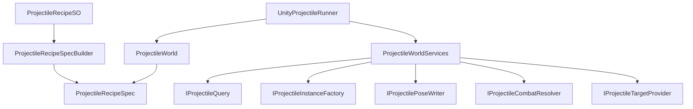

# 投射物系统介绍

## 1. 文档目的

本文用于介绍当前项目中新迁移的投射物系统，帮助后续开发者理解：

- 这套系统解决什么问题。
- 各目录、类、接口分别负责什么。
- 一颗子弹从生成到销毁会经历哪些流程。
- Unity、战斗系统、SO 配置如何接入核心层。
- 后续要扩展新运动、新检测、新命中规则时应该改哪里。

本文只介绍当前已落地的第一版投射物系统，不包含旧项目中的 Weapon 层、外部表配置、帧级终止规则、反弹、可受击 Projectile、网络同步等未迁移内容。

## 2. 总体目标

这套投射物系统的目标是把“子弹核心规则”和“Unity 具体实现”拆开。

核心层只负责：

- 创建投射物。
- 推进 Tick。
- 计算运动。
- 发起检测请求。
- 合并命中结果。
- 处理命中过滤、命中响应、战斗结算入口。
- 判断停止条件。
- 输出发射、命中、停止事件。

核心层不负责：

- `MonoBehaviour` 生命周期。
- `Physics` 检测。
- `GameObject` 或 Prefab 创建。
- `Transform` 同步。
- `CombatEntity`、`DamageAction`、`RegenerationAction`。
- ScriptableObject 编辑器数据。

这些 Unity 或项目相关能力都放在适配层，通过接口注入给核心层。

## 3. 当前目录结构

```text
Assets/HotfixScripts/Script/Module/Fight/Projectile/
  Core/
    Game.Projectile.Core.asmdef
    API/
      ProjectileAPI.cs
    Config/
      ProjectileSpecs.cs
    Detection/
      ProjectileDetection.cs
    Hit/
      ProjectileHitProcessing.cs
    Motion/
      ProjectileMotionModules.cs
    Runtime/
      ProjectileCoreTypes.cs
      ProjectileMath.cs
      ProjectileRuntimeState.cs
      ProjectileWorld.cs
    Spawn/
      ProjectileRequests.cs
      ProjectileSpawner.cs
    Stop/
      ProjectileStopPolicy.cs

  Authoring/
    ProjectileRecipeSO.cs
    ProjectileRecipeModuleConfigs.cs
    ProjectileRecipeSpecBuilder.cs

  UnityAdapter/
    UnityProjectileDetectionShapes.cs
    ProjectileUnityConversion.cs
    UnityProjectileRunner.cs
    UnityProjectileServices.cs

  CombatAdapter/
    ProjectileCombatAdapters.cs
```

## 4. 分层说明

### 4.1 Core

`Core` 是纯 C# 核心层。

它通过 `Game.Projectile.Core.asmdef` 独立出来，并开启 `noEngineReferences`，所以这里不能引用 Unity。

Core 内的对象应该可以在以下环境复用：

- Unity Runtime。
- EditMode 纯逻辑测试。
- 服务器模拟。
- 非 Unity 的工具或验证环境。

Core 的关键类：

- `ProjectileWorld`：投射物运行容器。
- `ProjectileWorldServices`：外部服务注入点。
- `ProjectileRecipeSpec`：运行时配方。
- `ProjectileRuntimeState`：单颗投射物运行状态。
- `ProjectileSpawner`：处理单发、多发、散射、随机角。
- `ProjectileHitProcessor`：处理命中过滤、目标冷却、命中响应、战斗结算入口。
- `ProjectileStopPolicy`：处理生命周期、距离、目标丢失等停止逻辑。
- `ProjectileAPI`：静态薄门面。

### 4.2 Authoring

`Authoring` 是 Unity 编辑配置层。

它负责把 Inspector 中配置的 `ProjectileRecipeSO` 转换成核心层能用的纯 C# `ProjectileRecipeSpec`。

Authoring 的关键类：

- `ProjectileRecipeSO`：ScriptableObject 资产入口。
- `ProjectileRecipeModuleConfigs`：可序列化配置结构。
- `ProjectileRecipeSpecBuilder`：把 SO 配置构建成运行时 Spec。

注意：

- SO 只做编辑入口。
- 运行时不要直接把业务逻辑写进 SO。
- 核心 Tick 不依赖 SO。
- 所有 Inspector 暴露字段都需要使用 Odin `LabelText` 中文说明。

### 4.3 UnityAdapter

`UnityAdapter` 是 Unity 具体能力实现层。

它负责把 Unity 的能力转换成 Core 需要的接口：

- Unity `Update` 驱动 `ProjectileWorld.Tick`。
- Unity Physics 实现 `IProjectileQuery`。
- Prefab 实例实现 `IProjectileInstanceFactory`。
- Transform 写入实现 `IProjectilePoseWriter`。
- Unity 对象坐标读取实现 `IProjectileTargetProvider`。

UnityAdapter 的关键类：

- `UnityProjectileRunner`
- `UnityProjectilePhysicsQuery`
- `UnityProjectilePrefabFactory`
- `UnityProjectilePoseWriter`
- `UnityProjectileTargetProvider`
- `ProjectileUnityConversion`

### 4.4 CombatAdapter

`CombatAdapter` 是当前项目战斗系统接入层。

它负责把核心层的命中数据转换成当前项目的战斗行为：

- Collider 转 `CombatEntity`。
- 投射物命中转 `DamageAction`。
- 治疗型投射物命中转 `RegenerationAction`。
- 预留发射、命中、停止事件桥接入口。

CombatAdapter 的关键类：

- `UnityCombatProjectileTargetResolver`
- `ProjectileCombatResolver`
- `ProjectileActionPointBridge`

## 5. 核心对象关系



## 6. 一颗投射物的生命周期

### 6.1 初始化 World

Unity 场景中挂载 `UnityProjectileRunner`。

Runner 在 `OnEnable` 中创建 `ProjectileWorld`：

```text
UnityProjectileRunner.OnEnable
  -> CreateWorld
    -> 创建 ProjectileWorldServices
    -> 注入 Physics Query / Prefab Factory / Pose Writer / Target Provider / Combat Resolver
    -> new ProjectileWorld(services, queryBufferSize)
    -> 可选 ProjectileAPI.Initialize(world)
```

### 6.2 发射投射物

外部可以通过两种方式发射。

方式一：调用 Runner。

```csharp
runner.Spawn(recipe, position, direction, ownerObject, targetObject, canResolveHit);
```

方式二：调用静态 API。

```csharp
ProjectileAPI.Spawn(in request);
```

静态 API 只是薄门面，真正执行仍然在当前激活的 `ProjectileWorld`。

### 6.3 创建运行时状态

`ProjectileWorld.Spawn` 会委托 `ProjectileSpawner` 处理生成。

如果是多发散射，`ProjectileSpawner` 会根据：

- `SpawnCount`
- `SpawnAngle`
- `BatchRandomAngle`
- `RandomAngleMin`
- `RandomAngleMax`

计算每一颗子弹的方向，然后调用 `ProjectileWorld.SpawnSingle` 创建具体运行时状态。

`SpawnSingle` 会设置：

- `Handle`
- `Recipe`
- `Pose`
- `SpawnPosition`
- `OwnerId`
- `TargetId`
- `OwnerObject`
- `TargetObject`
- `BaseValue`
- `RemainingPierceCount`
- `RandomSeed`
- `CanResolveHit`

如果绑定了 `IProjectileInstanceFactory`，还会创建 Unity 表现实例。

### 6.4 Tick 推进

每一帧由外部调用：

```csharp
world.Tick(deltaTime);
```

Tick 内部流程：

```text
ProjectileWorld.Tick
  -> 遍历 activeProjectiles
  -> TickSingle
    -> AliveTime += deltaTime
    -> 执行运动模块
    -> 累加飞行距离
    -> 写入表现 Pose
    -> 判断是否需要命中检测
    -> 执行命中窗口
    -> 判断停止策略
```

### 6.5 运动计算

当前已实现运动模块：

- `LinearProjectileMotion`：直线运动。
- `StaticProjectileMotion`：静止投射物。
- `RoundProjectileMotion`：围绕出生点做圆周运动。
- `WeakHomingProjectileMotion`：弱追踪目标。

运动模块通过 `IProjectileMotionModule` 统一执行。

注意：运动模块实例会被同一份配方下的多颗投射物共享。模块字段不要保存单颗投射物状态；需要保存状态时，应放到 `ProjectileRuntimeState` 或后续引入 per-projectile module state。

### 6.6 命中检测

核心层不直接调用 Unity Physics。

核心层只发出查询请求：

```csharp
public interface IProjectileQuery
{
    int Query(in ProjectileQueryRequest request, ProjectileRawHit[] results);
}
```

Unity 层由 `UnityProjectilePhysicsQuery` 实现该接口。

Core 不保存具体检测类型枚举，只通过 `IProjectileDetectionShape` 携带一份外部实现层创建的检测形状数据。

UnityAdapter 当前提供的检测形状：

- `None`
- `SphereCastProjectileDetectionShape`
- `OverlapSphereProjectileDetectionShape`
- `OverlapBoxProjectileDetectionShape`
- `ConeOverlapProjectileDetectionShape`
- `RayFanProjectileDetectionShape`

Unity 查询使用 NonAlloc 版本，减少运行时 GC：

- `Physics.SphereCastNonAlloc`
- `Physics.OverlapSphereNonAlloc`
- `Physics.OverlapBoxNonAlloc`
- `Physics.RaycastNonAlloc`

### 6.7 命中合并

Unity 查询会得到一批 `ProjectileRawHit`。

核心层通过 `ProjectileHitAccumulator` 转成最终 `ProjectileHit`：

- 跳过空目标。
- 对 Entity 类型按 `TargetId` 去重。
- 同一目标多个 Collider 时保留最近命中。
- 按距离排序。

这样可以避免同一个敌人有多个 Collider 时被同一颗子弹重复结算。

### 6.8 命中处理

命中处理由 `ProjectileHitProcessor` 完成。

当前流程：

```text
ProjectileHitProcessor.Process
  -> 构建 ProjectileHitContext
  -> 执行 IProjectileHitFilter[]
  -> 检查同目标命中冷却
  -> 记录目标冷却
  -> 执行 IProjectileHitResponse[]
  -> 调用 IProjectileCombatResolver
  -> TotalHitCount++
  -> 判断是否停止
```

默认过滤器：

- `OwnerIgnoreProjectileHitFilter`

可扩展注入：

- `ProjectileWorldServices.HitFilters`
- `ProjectileWorldServices.HitResponses`

### 6.9 战斗结算

核心层只定义接口：

```csharp
public interface IProjectileCombatResolver
{
    void ResolveHit(ProjectileRuntimeState state, in ProjectileHitContext context);
}
```

当前项目由 `ProjectileCombatResolver` 实现。

如果 `ResolveType` 是 `Damage`：

```text
ProjectileCombatResolver
  -> CombatActionFactor.CreateActionAndExecute<DamageAction>
```

如果 `ResolveType` 是 `Regeneration`：

```text
ProjectileCombatResolver
  -> CombatActionFactor.CreateActionAndExecute<RegenerationAction>
```

如果 Runner 没绑定战斗结算器，投射物仍然可以生成、移动、检测、触发命中事件，只是不执行伤害或治疗。

### 6.10 停止与回收

停止逻辑由 `ProjectileStopPolicy` 和命中处理共同决定。

当前停止原因包括：

- `ManualStop`
- `LifeTime`
- `MaxDistance`
- `TargetHit`
- `PierceExhausted`
- `TargetLost`

停止后会：

- 标记 `IsRunning = false`。
- 触发 `ProjectileStopped` 事件。
- 调用运动模块 `OnDetach`。
- 通过 `IProjectileInstanceFactory.Release` 回收 Unity 表现对象。
- 将 `ProjectileRuntimeState` 重置后放回状态池。

## 7. 配置系统

### 7.1 ProjectileRecipeSO

`ProjectileRecipeSO` 是唯一的 Unity 配方资产入口。

它包含：

- 投射物资产 ID。
- 初始速度。
- 生成配置。
- 检测配置。
- 命中配置。
- 停止配置。
- 运动模块列表。

运行时使用时，调用：

```csharp
ProjectileRecipeSpec spec = recipe.BuildSpec();
```

`BuildSpec` 会缓存构建结果，`OnValidate` 时清空缓存。

### 7.2 生成配置

`ProjectileSpawnConfig` 对应 `ProjectileSpawnSettings`。

字段：

- `spawnCount`：发射数量。
- `spawnAngle`：相邻散射角。
- `batchRandomAngle`：整批是否共用随机角。
- `randomAngleMin`：随机角最小值。
- `randomAngleMax`：随机角最大值。

### 7.3 检测配置

`ProjectileDetectionConfig` 对应 `ProjectileDetectionSpec`。

字段：

- `type`：Authoring 层使用的检测形状选项，不进入 Core。
- `radius`：球检测半径、SphereCast 半径、扇形半径或射线扇形长度。
- `angle`：扇形角度或射线扇形总角度。
- `rayCount`：射线扇形的射线数量。
- `boxWidth`：盒体宽度。
- `boxHeight`：盒体高度。
- `boxLength`：盒体长度。
- `maxHits`：单次检测命中上限。

`maxHits` 会参与核心层命中窗口缓存容量计算，并受 `UnityProjectileRunner.queryBufferSize` 全局上限保护。

### 7.4 命中配置

`ProjectileHitConfig` 对应 `ProjectileHitSpec`。

字段：

- `resolveType`：结算类型。
- `resolveMode`：结算模式。
- `baseValue`：基础数值。
- `pierceCount`：穿透次数。
- `hitInterval`：周期命中间隔。
- `targetHitCooldown`：同一目标命中冷却。
- `ignoreOwner`：是否忽略发射者。

当前结算类型：

- `None`
- `Damage`
- `Regeneration`

当前结算模式：

- `OnLaunchOnly`
- `Continuous`
- `Periodic`

### 7.5 停止配置

`ProjectileStopConfig` 对应 `ProjectileStopSpec`。

字段：

- `maxLifeTime`：最大生命周期。
- `maxDistance`：最大飞行距离。
- `destroyOnTargetHit`：命中目标后销毁。
- `stopWhenTargetLost`：目标丢失时停止。

## 8. ProjectileWorldServices

`ProjectileWorldServices` 是核心层接入外部能力的总入口。

当前字段：

```csharp
public sealed class ProjectileWorldServices
{
    public IProjectileQuery Query;
    public IProjectileCombatResolver CombatResolver;
    public IProjectileTargetProvider TargetProvider;
    public IProjectileInstanceFactory InstanceFactory;
    public IProjectilePoseWriter PoseWriter;
    public IProjectileHitFilter[] HitFilters;
    public IProjectileHitResponse[] HitResponses;
}
```

各接口职责：

| 接口 | 职责 | 当前实现 |
| --- | --- | --- |
| `IProjectileQuery` | 执行空间检测 | `UnityProjectilePhysicsQuery` |
| `IProjectileCombatResolver` | 命中后战斗结算 | `ProjectileCombatResolver` |
| `IProjectileTargetProvider` | 获取目标当前位置 | `UnityProjectileTargetProvider` |
| `IProjectileInstanceFactory` | 创建和回收表现对象 | `UnityProjectilePrefabFactory` |
| `IProjectilePoseWriter` | 写入表现对象位置旋转缩放 | `UnityProjectilePoseWriter` |
| `IProjectileHitFilter[]` | 扩展命中过滤规则 | 默认包含忽略 Owner |
| `IProjectileHitResponse[]` | 扩展命中响应逻辑 | 当前预留 |

## 9. 静态 API

`ProjectileAPI` 是便捷入口，不是核心系统本体。

它只保存当前激活的 `ProjectileWorld` 引用。

当前能力：

- `Initialize`
- `Shutdown`
- `Spawn`
- `Tick`
- `Stop`

推荐用法：

```csharp
ProjectileAPI.Initialize(world);
ProjectileAPI.Spawn(in request);
ProjectileAPI.Stop(handle, ProjectileEndReason.ManualStop);
ProjectileAPI.Shutdown(world);
```

注意：

- 不要在 `ProjectileAPI` 里写 Unity Physics。
- 不要在 `ProjectileAPI` 里直接 Instantiate。
- 不要在 `ProjectileAPI` 里直接调用 DamageAction。
- 静态 API 只做转发，核心逻辑保持在 `ProjectileWorld`。

## 10. Unity 接入方式

### 10.1 场景组件

场景中需要准备：

- 一个 `UnityProjectileRunner`。
- 一个 `UnityProjectilePrefabFactory`。
- 一个实现 `IUnityProjectileTargetResolver` 的组件，例如 `UnityCombatProjectileTargetResolver`。
- 可选：一个实现 `IProjectileCombatResolver` 的组件，例如 `ProjectileCombatResolver`。

Runner 字段绑定：

- `默认投射物配方`：默认发射用的 `ProjectileRecipeSO`。
- `实例工厂`：Prefab 创建和回收。
- `目标解析器`：Collider 到命中目标的转换。
- `战斗结算器`：伤害、治疗结算，可选。
- `命中层级`：Unity Physics 检测 LayerMask。
- `触发器检测模式`：是否检测 Trigger。
- `单次查询缓存数量`：全局查询上限。
- `启用时初始化静态API`：是否把当前 World 注册给 `ProjectileAPI`。
- `自动Update驱动`：是否在 Runner 的 `Update` 中自动 Tick。

### 10.2 发射默认子弹

```csharp
ProjectileHandle handle = runner.SpawnDefault(
    position,
    direction,
    ownerObject,
    targetObject,
    canResolveHit: true);
```

### 10.3 发射指定配方子弹

```csharp
ProjectileHandle handle = runner.Spawn(
    recipe,
    position,
    direction,
    ownerObject,
    targetObject,
    canResolveHit: true);
```

### 10.4 手动 Tick

如果关闭 `自动Update驱动`，外部需要自己调用：

```csharp
runner.Tick(deltaTime);
```

这适合：

- 统一战斗时钟。
- 暂停系统。
- 回放系统。
- 服务器模拟。
- 固定步长测试。

## 11. 扩展指南

### 11.1 新增运动类型

适合改动位置：

- `ProjectileMotionType`
- 新增 `IProjectileMotionModule` 实现。
- `ProjectileMotionFactory.Create`
- `ProjectileMotionConfig` 中补字段。

注意：

- 模块实例会被配方共享。
- 不要在模块字段中保存单颗投射物的运行状态。
- 如果必须保存状态，优先扩展 `ProjectileRuntimeState` 或设计独立状态容器。

### 11.2 新增检测类型

适合改动位置：

- 新增一个实现 `IProjectileDetectionShape` 的具体 Shape 类，放在具体实现层，例如 `UnityAdapter`。
- `ProjectileDetectionConfig`
- `ProjectileRecipeSpecBuilder.BuildDetectionShape`
- `UnityProjectilePhysicsQuery.Query`

注意：

- 不要为了新增检测类型修改 Core。
- Core 只保留 `IProjectileDetectionShape` 接口和 `ProjectileDetectionSpec.Shape` 通道。
- Unity Physics 具体实现仍放在 UnityAdapter。
- 检测结果统一输出为 `ProjectileRawHit[]`。
- 命中合并仍交给 `ProjectileHitAccumulator`。

### 11.3 新增命中过滤

实现：

```csharp
public sealed class MyHitFilter : IProjectileHitFilter
{
    public bool CanHit(ProjectileRuntimeState state, in ProjectileHitContext context)
    {
        return true;
    }
}
```

注入：

```csharp
var services = new ProjectileWorldServices
{
    HitFilters = new IProjectileHitFilter[]
    {
        new OwnerIgnoreProjectileHitFilter(),
        new MyHitFilter(),
    },
};
```

适合场景：

- 阵营过滤。
- 免疫目标过滤。
- 护盾状态过滤。
- 只命中指定实体类型。

### 11.4 新增命中响应

实现：

```csharp
public sealed class MyHitResponse : IProjectileHitResponse
{
    public void OnHit(ProjectileRuntimeState state, in ProjectileHitContext context, ref ProjectilePose pose)
    {
    }
}
```

适合场景：

- 命中后改变方向。
- 命中后缩放。
- 命中后生成二段效果。
- 命中后播放非战斗逻辑事件。

如果响应依赖 Unity 特效、音效或 GameObject，不要写进 Core；可以让响应只发事件，或把响应实现放到 Unity/Combat 适配层。

### 11.5 新增战斗结算类型

适合改动位置：

- `ProjectileHitResolveType`
- `ProjectileHitConfig`
- `ProjectileCombatResolver.ResolveHit`

注意：

- Core 只知道结算类型枚举。
- 具体调用哪个战斗系统类，由 CombatAdapter 决定。
- 不要让 Core 直接引用 `CombatEntity` 或具体 Action。

## 12. 性能设计

当前已做的性能约束：

- 核心运行状态使用 `Stack<ProjectileRuntimeState>` 池化。
- Unity 物理查询使用 NonAlloc API。
- 命中窗口缓存使用 `ProjectileHitWindowBuffer` 租借，避免重入覆盖。
- 同目标命中冷却字典只在需要时创建。
- Collider 到 `CombatEntity` 解析有缓存和容量上限。
- 命中合并使用数组，避免热路径 List 分配。
- `ProjectileWorld.Tick` 倒序遍历活跃投射物，停止时可以 O(1) swap-remove。

当前仍需关注：

- `ProjectileHitAccumulator` 当前使用插入排序，适合小规模命中；如果单次命中上限变很大，需要重新评估。
- `UnityProjectilePhysicsQuery.FillColliderHits` 会调用 `Collider.ClosestPoint`，高频大范围检测下可能成为热点。
- `UnityCombatProjectileTargetResolver` 仍会在首次遇到 Collider 时调用 `GetComponentInParent<CombatEntity>`，大量新 Collider 初次命中时可能有成本。
- 运动模块按配方共享，后续不要写入模块实例状态。

## 13. 当前不支持的内容

第一版暂不支持：

- 旧 Weapon 层。
- 外部表配置。
- `IProjectileFrameTerminateRule` 帧级终止规则。
- 反弹。
- 子弹生成子弹。
- 可受击 Projectile。
- 网络同步。
- 复杂技能资源消耗。
- 编辑器 Gizmos 可视化。
- 真正接入 ActionPoint 的投射物事件桥接。

其中 `ProjectileActionPointBridge` 当前只是预留空实现，不代表已接入具体 ActionPoint 行为。

## 14. 验证建议

接入 Unity 场景后，建议至少验证：

- 单发直线弹能生成、移动、回收。
- 命中敌人能扣血。
- 治疗型投射物能回血，并触发 `PreRestoreHP/PostRestoreHP`。
- `DestroyOnTargetHit` 能命中后销毁。
- `MaxLifeTime` 到期后能停止。
- `MaxDistance` 超出后能停止。
- 多发散射角度正确。
- 同一敌人多个 Collider 不会重复结算。
- `targetHitCooldown` 能阻止同目标高频重复命中。
- `Periodic` 模式按间隔结算。
- `OnLaunchOnly` 模式只在发射时检测。
- 关闭战斗结算器后仍能移动、检测、触发事件。
- `ProjectileAPI.Spawn` 能通过当前 Runner 初始化的 World 发射。

## 15. 后续推荐优化

后续可以按优先级继续补：

1. 为 `ProjectileActionPointBridge` 接入真实 ActionPoint 行为。
2. 增加 EditMode 测试，覆盖 Spawn、Tick、Hit、Stop、Pierce、Cooldown。
3. 拆分 `UnityProjectileServices.cs`，让 PhysicsQuery、PoseWriter、PrefabFactory 独立成文件。
4. 增加 Collider 注册表或轻量代理组件，替代首次命中的 `GetComponentInParent`。
5. 如果需要有状态运动模块，引入 per-projectile module state。
6. 如果需要反弹，新增命中响应或停止策略，并明确和命中销毁的优先级。
7. Unity Editor 刷新 asmdef/csproj 后执行完整项目构建和 PlayMode 场景验证。
